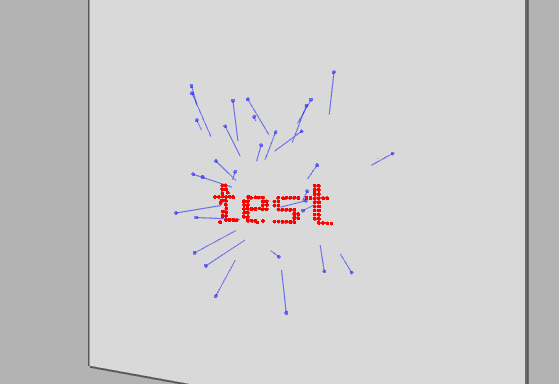

# RayCaptcha
A CAPTCHA test using ray-plane intersections

## Project Structure
The project includes the `raycaptcha` library and two executables: `rcjson` and `rcfrontend`

### The RayCaptcha Library
The library exports a single function
```C
size_t raycaptcha(const char *s, size_t len, ray_t rays[]);
```
That will take in a string and generate a series of rays that will spell out that string when projected onto a plane of an unknown orientation and position.

### rcjson
`rcjson` is a command line application the will output the rays in JSON format to stdout. The input parameter is the word you wish to spell out.
```bash
$ rcjson [WORD]
```
This can be embedded into the backend of a web application. However, command line interoperability can be an issue when deploying a web application to an external server. I eventually rewrote it in PHP. See
[raycaptcha.php](https://github.com/jcklmbrt/raycaptcha/blob/main/raycaptcha.php)

### rcfrontend
`rcfrontend` is a graphical application that will show a visual representation of the rays and the intersection points on a plane. You can use the arrow keys (or hjkl) to move the plane until the message is clear.



## Building the project

This project depends on GLFW. Make sure you have the dependencies required to build GLFW.
https://www.glfw.org/docs/latest/compile.html

```bash
$ git clone --recurse-submodules https://github.com/jcklmbrt/rcfrontend.git
$ mkdir rcfrontend/build
$ cd rcfrontend/build
$ cmake .. -G Ninja
$ ninja
```